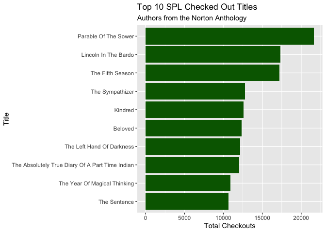
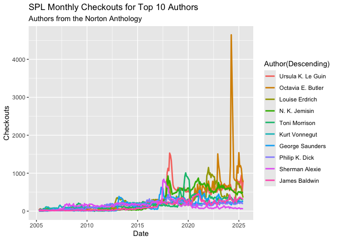
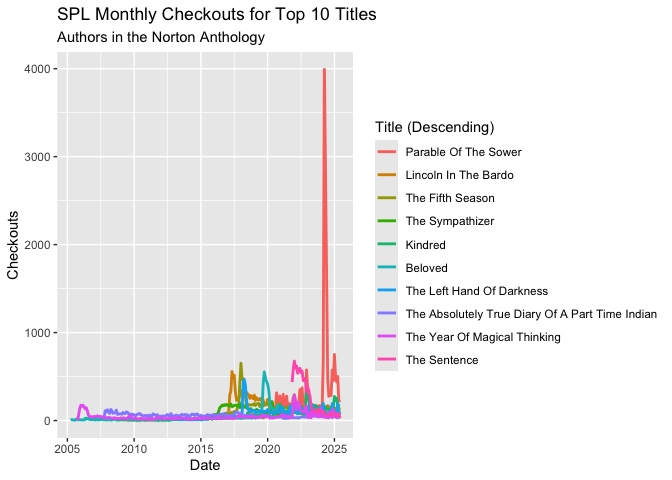
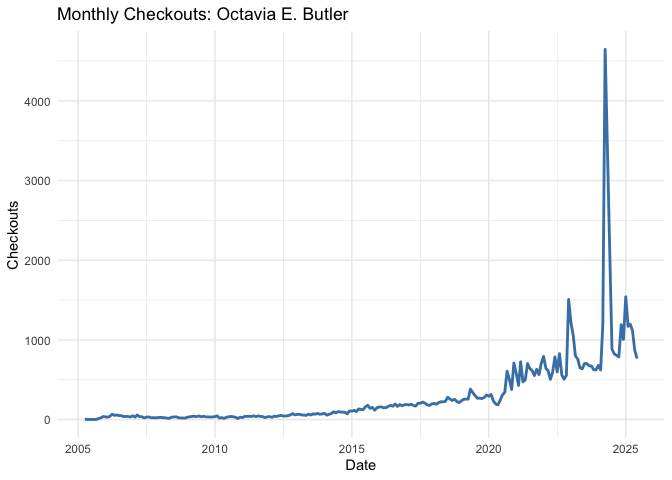
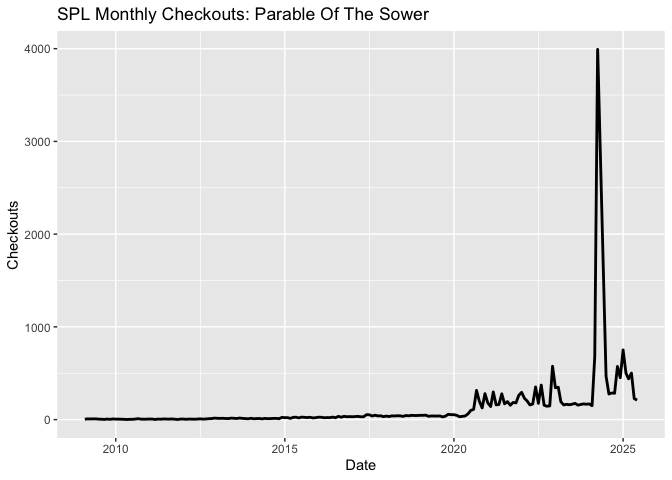
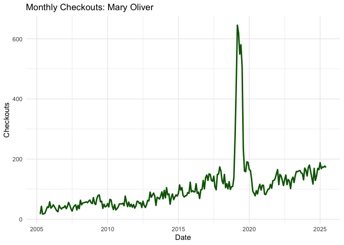
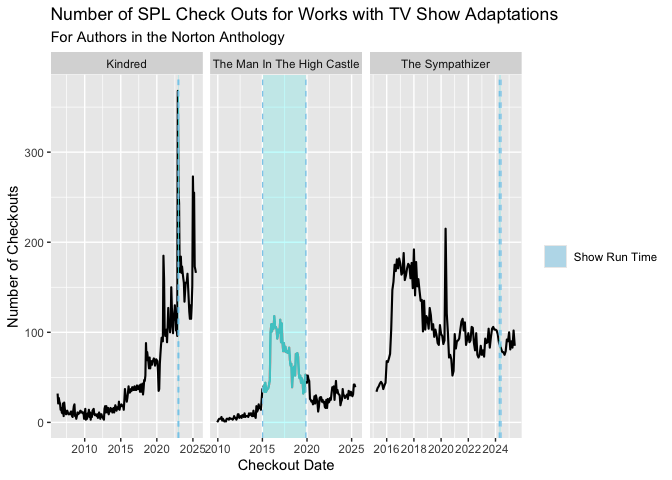
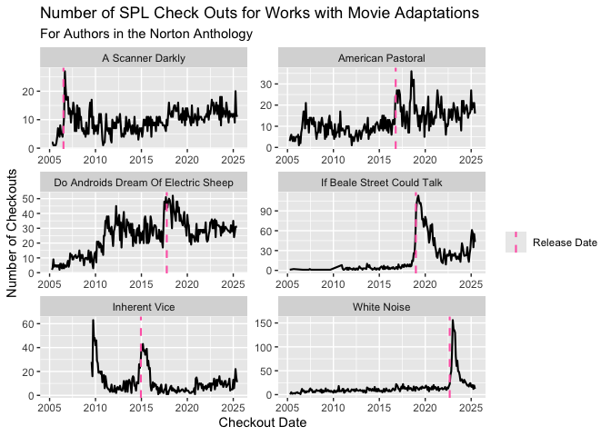

Norton Anthology and SPL Checkouts
================
2025-07-16

    ## 
    ## Attaching package: 'dplyr'

    ## The following objects are masked from 'package:stats':
    ## 
    ##     filter, lag

    ## The following objects are masked from 'package:base':
    ## 
    ##     intersect, setdiff, setequal, union

    ## 
    ## Attaching package: 'lubridate'

    ## The following objects are masked from 'package:base':
    ## 
    ##     date, intersect, setdiff, union

    ## ── Attaching core tidyverse packages ──────────────────────── tidyverse 2.0.0 ──
    ## ✔ forcats 1.0.0     ✔ stringr 1.5.1
    ## ✔ purrr   1.0.4     ✔ tibble  3.3.0
    ## ✔ readr   2.1.5     ✔ tidyr   1.3.1
    ## ── Conflicts ────────────────────────────────────────── tidyverse_conflicts() ──
    ## ✖ tidyr::extract()   masks magrittr::extract()
    ## ✖ dplyr::filter()    masks stats::filter()
    ## ✖ dplyr::lag()       masks stats::lag()
    ## ✖ purrr::set_names() masks magrittr::set_names()
    ## ℹ Use the conflicted package (<http://conflicted.r-lib.org/>) to force all conflicts to become errors

``` r
data <- read.csv(file = "https://seattle-library-checkout-data.s3.us-west-2.amazonaws.com/norton-anthology_spl-checkouts_2005-2025.csv", header = TRUE, stringsAsFactors = FALSE)
```

# Top Authors, Titles, and Statistics

``` r
# (unique(data["Normalized.Creator"]))
# (unique(data["Normalized.Title"]))

data %>%
  group_by(Normalized.Creator) %>%
  summarise(TotalCheckouts = sum(Checkouts, na.rm = TRUE))
```

    ## # A tibble: 93 × 2
    ##    Normalized.Creator TotalCheckouts
    ##    <chr>                       <int>
    ##  1 A. R. Ammons                  284
    ##  2 Adrienne Rich                2592
    ##  3 Alice Walker                11953
    ##  4 Alison Bechdel              11829
    ##  5 Allen Ginsberg               2333
    ##  6 Amiri Baraka                  708
    ##  7 Amy Tan                     23506
    ##  8 Anne Sexton                   334
    ##  9 Annie Dillard               11050
    ## 10 Art Spiegelman               7341
    ## # ℹ 83 more rows

``` r
df <- data

top_authors <- df %>%
  group_by(Normalized.Creator) %>%
  summarise(TotalCheckouts = sum(Checkouts, na.rm = TRUE)) %>%
  arrange(desc(TotalCheckouts)) %>%
  slice_head(n = 10)

print("Top 10 Most Checked Out Authors:")
```

    ## [1] "Top 10 Most Checked Out Authors:"

``` r
print(top_authors)
```

    ## # A tibble: 10 × 2
    ##    Normalized.Creator TotalCheckouts
    ##    <chr>                       <int>
    ##  1 Ursula K. Le Guin           73224
    ##  2 Octavia E. Butler           65386
    ##  3 Louise Erdrich              60846
    ##  4 N. K. Jemisin               59859
    ##  5 Toni Morrison               47501
    ##  6 Kurt Vonnegut               41462
    ##  7 George Saunders             38838
    ##  8 Philip K. Dick              38230
    ##  9 Sherman Alexie              37477
    ## 10 James Baldwin               32463

``` r
# most checked out titles
top_titles <- df %>%
  group_by(Normalized.Title) %>%
  summarise(TotalCheckouts = sum(Checkouts, na.rm = TRUE)) %>%
  arrange(desc(TotalCheckouts)) %>%
  slice_head(n = 10)

print("Top 10 Most Checked Out Titles:")
```

    ## [1] "Top 10 Most Checked Out Titles:"

``` r
print(top_titles)
```

    ## # A tibble: 10 × 2
    ##    Normalized.Title                                TotalCheckouts
    ##    <chr>                                                    <int>
    ##  1 Parable Of The Sower                                     21652
    ##  2 Lincoln In The Bardo                                     17356
    ##  3 The Fifth Season                                         17223
    ##  4 The Sympathizer                                          12792
    ##  5 Kindred                                                  12591
    ##  6 Beloved                                                  12330
    ##  7 The Left Hand Of Darkness                                12148
    ##  8 The Absolutely True Diary Of A Part Time Indian          12043
    ##  9 The Year Of Magical Thinking                             10907
    ## 10 The Sentence                                             10658

``` r
# Bar chart for top authors
ggplot(top_authors, aes(x = reorder(Normalized.Creator, TotalCheckouts), y = TotalCheckouts)) +
  geom_bar(stat = "identity", fill = "royalblue") +
  coord_flip() +
  labs(
    title = "Top 10 SPL Checked Out Authors",
    subtitle = "Authors from the Norton Anthology",
    x = "Author",
    y = "Total Checkouts"
  )
```

<!-- -->

``` r
# Bar chart for top titles
ggplot(top_titles, aes(x = reorder(Normalized.Title, TotalCheckouts), y = TotalCheckouts)) +
  geom_bar(stat = "identity", fill = "darkgreen") +
  coord_flip() +
  labs(
    title = "Top 10 SPL Checked Out Titles",
    subtitle = "Authors from the Norton Anthology",
    x = "Title",
    y = "Total Checkouts"
  )
```

<!-- -->

``` r
# Create CheckoutDate column
df <- df %>%
  mutate(CheckoutDate = as.Date(paste(CheckoutYear, CheckoutMonth, "01", sep = "-")))

# Find top 10 authors by total checkouts
top10_authors <- df %>%
  group_by(Normalized.Creator) %>%
  summarise(TotalCheckouts = sum(Checkouts, na.rm = TRUE)) %>%
  arrange(desc(TotalCheckouts)) %>%
  slice_head(n = 10) %>%
  pull(Normalized.Creator)

# Filter data to include only top 10 authors
top_authors_df <- df %>%
  filter(Normalized.Creator %in% top10_authors)

# Group by date and author
author_ts_all <- top_authors_df %>%
  group_by(CheckoutDate, Normalized.Creator) %>%
  summarise(Checkouts = sum(Checkouts, na.rm = TRUE), .groups = "drop")

# Reorder authors by total checkouts (descending)
author_order <- author_ts_all %>%
  group_by(Normalized.Creator) %>%
  summarise(Total = sum(Checkouts, na.rm = TRUE)) %>%
  arrange(desc(Total)) %>%
  pull(Normalized.Creator)

author_ts_all$Normalized.Creator <- factor(author_ts_all$Normalized.Creator, levels = author_order)

# Plot
ggplot(author_ts_all, aes(x = CheckoutDate, y = Checkouts, color = Normalized.Creator)) +
  geom_line(size = 1) +
  labs(
    title = "SPL Monthly Checkouts for Top 10 Authors",
    subtitle = "Authors from the Norton Anthology",
    x = "Date",
    y = "Checkouts",
    color = "Author(Descending)"
  )
```

    ## Warning: Using `size` aesthetic for lines was deprecated in ggplot2 3.4.0.
    ## ℹ Please use `linewidth` instead.
    ## This warning is displayed once every 8 hours.
    ## Call `lifecycle::last_lifecycle_warnings()` to see where this warning was
    ## generated.

<!-- -->

``` r
# Normalize the date
df <- df %>%
  mutate(CheckoutDate = as.Date(paste(CheckoutYear, CheckoutMonth, "01", sep = "-")))

# Get top 10 titles by total checkouts
top_10_titles <- df %>%
  group_by(Normalized.Title) %>%
  summarise(TotalCheckouts = sum(Checkouts, na.rm = TRUE)) %>%
  arrange(desc(TotalCheckouts)) %>%
  slice_head(n = 10) %>%
  pull(Normalized.Title)

# Filter to top 10 titles only
df_top_titles <- df %>%
  filter(Normalized.Title %in% top_10_titles)

# Group by title and checkout date
title_time_series <- df_top_titles %>%
  group_by(Normalized.Title, CheckoutDate) %>%
  summarise(Checkouts = sum(Checkouts, na.rm = TRUE), .groups = "drop")

# Reorder titles by total checkouts (descending)
title_order <- title_time_series %>%
  group_by(Normalized.Title) %>%
  summarise(Total = sum(Checkouts, na.rm = TRUE)) %>%
  arrange(desc(Total)) %>%
  pull(Normalized.Title)

title_time_series$Normalized.Title <- factor(title_time_series$Normalized.Title, levels = title_order)

ggplot(title_time_series, aes(x = CheckoutDate, y = Checkouts, color = Normalized.Title)) +
  geom_line(size = 1) +
  labs(
    title = "SPL Monthly Checkouts for Top 10 Titles",
    subtitle = "Authors in the Norton Anthology",
    x = "Date",
    y = "Checkouts",
    color = "Title (Descending)"
  ) +
  theme(legend.position = "right")
```

<!-- -->

``` r
butler_df <- df %>%
  filter(Normalized.Creator == "Octavia E. Butler") %>%
  group_by(CheckoutDate) %>%
  summarise(Checkouts = sum(Checkouts, na.rm = TRUE))

butler <- ggplot(butler_df, aes(x = CheckoutDate, y = Checkouts)) +
  geom_line(color = "steelblue", size = 1) +
  labs(title = "Monthly Checkouts: Octavia E. Butler", x = "Date", y = "Checkouts") +
  theme_minimal()

butler
```

<!-- -->

``` r
parable_df <- df %>%
  filter(Normalized.Title == "Parable Of The Sower") %>%
  group_by(CheckoutDate) %>%
  summarise(Checkouts = sum(Checkouts, na.rm = TRUE))

ggplot(parable_df, aes(x = CheckoutDate, y = Checkouts)) +
  geom_line(size = 1) +
  labs(title = "SPL Monthly Checkouts: Parable Of The Sower", x = "Date", y = "Checkouts")
```

<!-- -->

``` r
oliver_df <- df %>%
  filter(Normalized.Creator == "Mary Oliver") %>%
  group_by(CheckoutDate) %>%
  summarise(Checkouts = sum(Checkouts, na.rm = TRUE))

ggplot(oliver_df, aes(x = CheckoutDate, y = Checkouts)) +
  geom_line(color = "darkgreen", size = 1) +
  labs(title = "Monthly Checkouts: Mary Oliver", x = "Date", y = "Checkouts") +
  theme_minimal()
```

<!-- -->

# TV and Movie Book Adaptations

``` r
adaptation_authors <- c("Chris Kraus", "Don DeLillo", "Philip Roth", "Philip K. Dick", "Viet Thanh Nguyen", "Octavia E. Butler", "james baldwin", "thomas pynchon")

adaptation_df <- data %>%
  filter(grepl(paste(adaptation_authors, collapse = "|"), Normalized.Creator, ignore.case = TRUE))

titles <- c("White Noise", "Do Androids Dream Of Electric Sheep", "American Pastoral", "The Sympathizer", "Kindred", "A Scanner Darkly", "The Man In The High Castle", "If Beale Street Could Talk", "Inherent Vice")
```

``` r
adaptation_df %<>%
  mutate(CheckoutDate = as.Date(paste(CheckoutYear, CheckoutMonth, "01", sep = "-")))
```

``` r
tv_titles <- c("The Man In The High Castle", "Kindred", "The Sympathizer")

movie_titles <- c("White Noise", "Do Androids Dream Of Electric Sheep", "American Pastoral", "A Scanner Darkly", "If Beale Street Could Talk", "Inherent Vice")

movie_info <- data.frame(
  Normalized.Title = movie_titles,
  ReleaseDate = as.Date(c("2022-08-31", "2017-10-06", "2016-10-13", "2006-07-07", "2018-12-25", "2014-12-12"))
)

tv_info <- data.frame(
  Normalized.Title = tv_titles,
  FirstEpisode = as.Date(c("2015-01-15", "2022-12-13", "2024-04-14")),
  LastEpisode = as.Date(c("2019-11-15", "2023-01-13", "2024-05-26"))
)
```

``` r
movie_data <- left_join(adaptation_df, movie_info, by = "Normalized.Title")
tv_data <- left_join(adaptation_df, tv_info, by = "Normalized.Title")
```

## TV Show Adaptation Plot

``` r
tv_data %>%
  filter(Normalized.Title %in% tv_titles) %>%
  group_by(Normalized.Title, CheckoutDate, FirstEpisode, LastEpisode) %>%
  summarize(Checkouts = sum(Checkouts)) %>%
  ggplot(aes(x = CheckoutDate, y = Checkouts)) +
  geom_line(size = 0.75) +
  facet_wrap(~Normalized.Title, scales = "free_x") +
  labs(
    x = "Checkout Date",
    y = "Number of Checkouts",
    title = "Number of SPL Check Outs for Works with TV Show Adaptations",
    subtitle = "For Authors in the Norton Anthology"
  ) +
  geom_vline(aes(xintercept = FirstEpisode), linetype = "dashed", color = "skyblue") +
  geom_vline(aes(xintercept = LastEpisode), linetype = "dashed", color = "skyblue") +
  geom_rect(aes(xmin = FirstEpisode, xmax = LastEpisode, ymin = -Inf, ymax = Inf, fill = "Show Run Time"), alpha = 0.006) +
  scale_fill_manual(name = NULL, values = c("Show Run Time" = "skyblue")) +
  guides(fill = guide_legend(override.aes = list(alpha = 0.5)))
```

    ## `summarise()` has grouped output by 'Normalized.Title', 'CheckoutDate',
    ## 'FirstEpisode'. You can override using the `.groups` argument.

<!-- -->

## Movie Adaptation Plot

``` r
movie_data %>%
  filter(Normalized.Title %in% movie_titles) %>%
  group_by(Normalized.Title, CheckoutDate, ReleaseDate, Normalized.Creator) %>%
  summarize(Checkouts = sum(Checkouts)) %>%
  ggplot(aes(x = CheckoutDate, y = Checkouts)) +
  geom_line(size = 0.75) +
  facet_wrap(~Normalized.Title, scales = "free", nrow = 3, ncol = 2) +
  labs(
    x = "Checkout Date",
    y = "Number of Checkouts",
    title = "Number of SPL Check Outs for Works with Movie Adaptations",
    subtitle = "For Authors in the Norton Anthology",
    linetype = ""
  ) +
  geom_vline(aes(xintercept = ReleaseDate, linetype = "Release Date"),
    color = "hotpink", size = 0.75
  ) +
  xlim(as.Date("2005-01-01"), as.Date("2025-07-17")) +
  scale_linetype_manual(values = c("Release Date" = "dashed"))
```

    ## `summarise()` has grouped output by 'Normalized.Title', 'CheckoutDate',
    ## 'ReleaseDate'. You can override using the `.groups` argument.

<!-- -->

# Author Deaths

``` r
author_data <- filter(data, Normalized.Creator %in% c("John Updike", "Philip Roth", "Mary Oliver", "Toni Morrison", "Joan Didion", "N. Scott Momaday", "David Foster Wallace"))

author_data <- author_data |> mutate("CheckoutDate" = as.Date(paste(CheckoutYear, CheckoutMonth, "1", sep = "-")))

author_data <- author_data %>%
  group_by(CheckoutDate, Normalized.Creator) %>%
  summarise(Checkouts = sum(Checkouts))
```

    ## `summarise()` has grouped output by 'CheckoutDate'. You can override using the
    ## `.groups` argument.

``` r
author_info <- data.frame(
  Normalized.Creator = c("Joan Didion", "John Updike", "Mary Oliver", "N. Scott Momaday", "Philip Roth", "Toni Morrison", "David Foster Wallace"),
  DeathDate = as.Date(c("2021-12-23", "2009-01-27", "2019-01-17", "2024-01-24", "2018-05-22", "2019-08-05", "2008-09-12"))
)

# joining
author_data <- left_join(author_data, author_info, by = "Normalized.Creator")

typeof(author_data$CheckoutDate)
```

    ## [1] "double"

``` r
typeof(author_data$DeathDate)
```

    ## [1] "double"

``` r
author_data$CheckoutDate <- as.Date(author_data$CheckoutDate)
```

``` r
ggplot(author_data) +
  geom_line(aes(x = CheckoutDate, y = Checkouts), size = 0.75) +
  facet_wrap(~Normalized.Creator, scales = "free", nrow = 4, ncol = 2) +
  geom_vline(aes(xintercept = DeathDate, linetype = "Death Date"), color = "red", size = 1) +
  labs(
    x = "Checkout Date",
    y = "Number of Checkouts",
    title = "SPL Checkouts For Authors Who Died After 2005",
    subtitle = "Authors Selected from the Norton Anthology",
    linetype = ""
  ) +
  scale_linetype_manual(values = c("Death Date" = "dashed"))
```

<!-- -->
