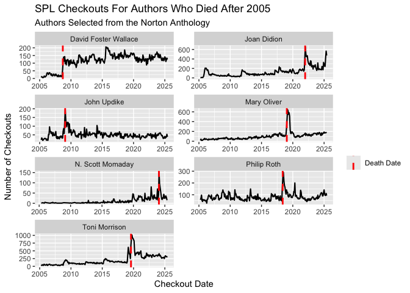

Deaths of the Authors
================

``` r
spl_df <- read.csv("https://seattle-library-checkout-data.s3.us-west-2.amazonaws.com/norton-anthology_spl-checkouts_2005-2025.csv")

library(dplyr)
```

    ## 
    ## Attaching package: 'dplyr'

    ## The following objects are masked from 'package:stats':
    ## 
    ##     filter, lag

    ## The following objects are masked from 'package:base':
    ## 
    ##     intersect, setdiff, setequal, union

``` r
library(tidyverse)
```

    ## Warning: package 'tibble' was built under R version 4.3.3

    ## Warning: package 'purrr' was built under R version 4.3.3

    ## ── Attaching core tidyverse packages ──────────────────────── tidyverse 2.0.0 ──
    ## ✔ forcats   1.0.0     ✔ readr     2.1.5
    ## ✔ ggplot2   3.5.1     ✔ stringr   1.5.1
    ## ✔ lubridate 1.9.3     ✔ tibble    3.3.0
    ## ✔ purrr     1.0.4     ✔ tidyr     1.3.1

    ## ── Conflicts ────────────────────────────────────────── tidyverse_conflicts() ──
    ## ✖ dplyr::filter() masks stats::filter()
    ## ✖ dplyr::lag()    masks stats::lag()
    ## ℹ Use the conflicted package (<http://conflicted.r-lib.org/>) to force all conflicts to become errors

``` r
author_data <- filter(spl_df, Normalized.Creator %in% c("John Updike", "Philip Roth", "Mary Oliver", "Toni Morrison", "Joan Didion", "N. Scott Momaday", "David Foster Wallace"))

author_data <- author_data |> mutate("CheckoutDate" = as.Date(paste(CheckoutYear, CheckoutMonth, "1", sep = "-")))

author_data <- author_data %>%
    group_by(CheckoutDate, Normalized.Creator) %>%
    summarise(Checkouts = sum(Checkouts))
```

    ## `summarise()` has grouped output by 'CheckoutDate'. You can override using the
    ## `.groups` argument.

``` r
author_info <- data.frame(
    Normalized.Creator = c("Joan Didion", "John Updike", "Mary Oliver", "N. Scott Momaday", "Philip Roth", "Toni Morrison", "David Foster Wallace"),
    DeathDate = as.Date(c("2021-12-23", "2009-01-27", "2019-01-17", "2024-01-24", "2018-05-22", "2019-08-05", "2008-09-12"))
)

# joining
author_data <- left_join(author_data, author_info, by = "Normalized.Creator")

typeof(author_data$CheckoutDate)
```

    ## [1] "double"

``` r
typeof(author_data$DeathDate)
```

    ## [1] "double"

``` r
author_data$CheckoutDate <- as.Date(author_data$CheckoutDate)

ggplot(author_data) +
    geom_line(aes(x = CheckoutDate, y = Checkouts), size = 0.75) +
    facet_wrap(~Normalized.Creator, scales = "free", nrow = 4, ncol = 2) +
    geom_vline(aes(xintercept = DeathDate, linetype = "Death Date"), color = "red", size = 1) +
    labs(
        x = "Checkout Date",
        y = "Number of Checkouts",
        title = "SPL Checkouts For Authors Who Died After 2005",
        subtitle = "Authors Selected from the Norton Anthology",
        linetype = ""
    ) +
    scale_linetype_manual(values = c("Death Date" = "dashed"))
```

    ## Warning: Using `size` aesthetic for lines was deprecated in ggplot2 3.4.0.
    ## ℹ Please use `linewidth` instead.
    ## This warning is displayed once every 8 hours.
    ## Call `lifecycle::last_lifecycle_warnings()` to see where this warning was
    ## generated.

<!-- -->
